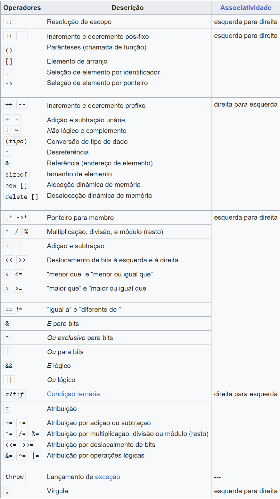
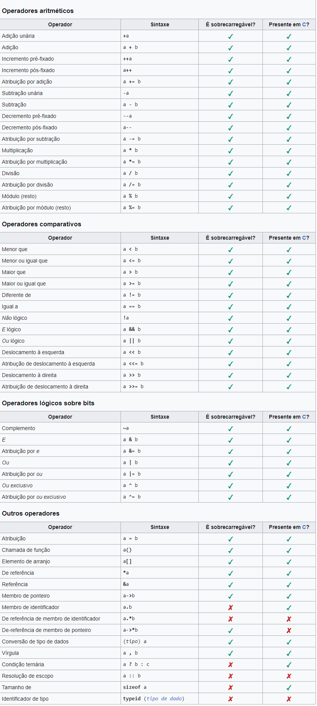

# Projeto de Introdução

Estudo sobre C++

## Estrutura do Diretório

```
introduction/
├── *.cpp               # Arquivos de código-fonte introdutórios
├── bin/                # Binários pré-compilados
├── build.bat           # Script em batch do Windows para compilar todos os arquivos fonte

practicing/
├── *.cpp               # Arquivos de prática com exemplos diversos
├── bin/                # Binários pré-compilados para arquivos de prática
├── build.bat           # Script para compilar os exemplos de prática

src/
├── hypotenuse.png      # Imagem/diagrama relacionado ao cálculo da hipotenusa

.vscode/
├── settings.json       # Configurações do ambiente de desenvolvimento VS Code
```

## Descrição dos Arquivos Fonte

### introduction/

- **arithmetic.cpp**: Demonstra operações aritméticas básicas.
- **constKeyword.cpp**: Explora o uso da palavra-chave `const` em C++.
- **func.cpp**: Ilustra a definição e uso de funções.
- **helloworld.cpp**: Um clássico programa "Olá, Mundo!".
- **ifStatements.cpp**: Demonstra o uso de instruções condicionais.
- **mathFunction.cpp**: Exibe funções matemáticas úteis.
- **nameSpace.cpp**: Introduz namespaces em C++.
- **ternaryOperator.cpp**: Explica o operador ternário em expressões condicionais.
- **typeConversion.cpp**: Mostra técnicas de conversão de tipos.
- **typedefIn.cpp**: Demonstra o uso de `typedef` para criar alias de tipos de dados.
- **userInput.cpp**: Aceita e processa entrada do usuário.
- **variable.cpp**: Explica declarações e inicializações de variáveis.

### practicing/

- **calc.cpp**: Uma simples calculadora.
- **hypotenuse.cpp**: Algoritmo para calcular a hipotenusa.
- **month.cpp**: Exemplo de uso Else if com manipulação de meses.
- **ParImpar.cpp**: Determina se um número é par ou ímpar.
- **S_month.cpp**: Algoritmo para trabalhar com meses de forma correta.

## Binários Pré-compilados

### introduction/bin/

Contém executáveis dos arquivos da pasta `introduction/`, como `helloworld.exe`, `arithmetic.exe`, etc.

### practicing/bin/

Contém executáveis dos arquivos da pasta `practicing/`, como `calc.exe`, `hypotenuse.exe`, etc.

## Como Compilar

### Windows (Usando `build.bat`)

1. Abra um terminal no diretório correspondente (`introduction/` ou `practicing/`).
2. Execute o seguinte comando:
   ```
   build.bat
   ```
   Isso compilará todos os arquivos `.cpp` e colocará os executáveis no diretório `bin/`.

### Operadores em C++





### Compilação Manual

Para compilar arquivos individuais, use o comando:
```
g++ <nome_do_arquivo>.cpp -o bin/<nome_do_arquivo>
```

## Como Executar

1. Navegue até o diretório `bin/`.
2. Execute o executável desejado digitando seu nome, por exemplo:
   ```
   helloworld.exe
   ```

## Requisitos

- Um compilador C++ (por exemplo, GCC, Clang, MSVC).
- Windows (se estiver usando o script em batch fornecido).

## Licença

Este projeto é fornecido "como está" para fins educacionais.
